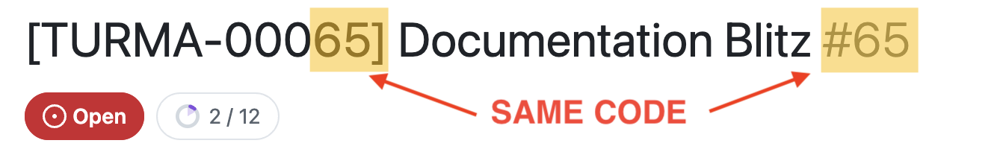
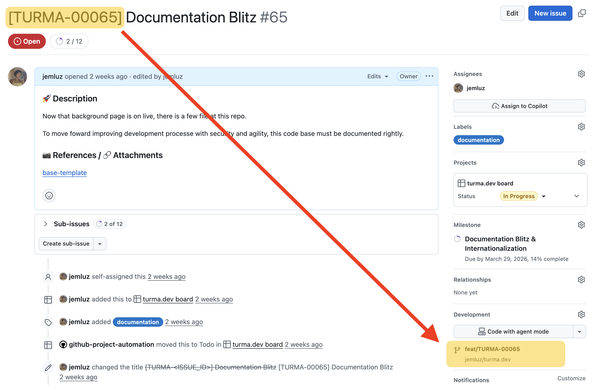
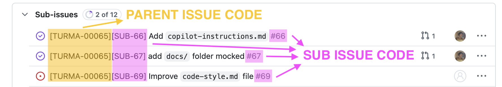
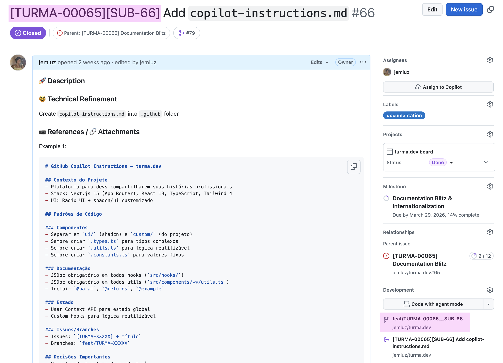
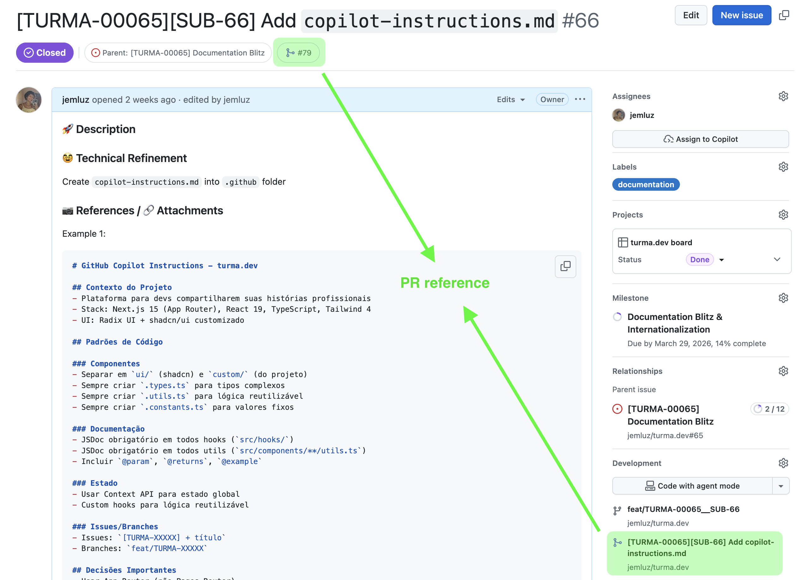
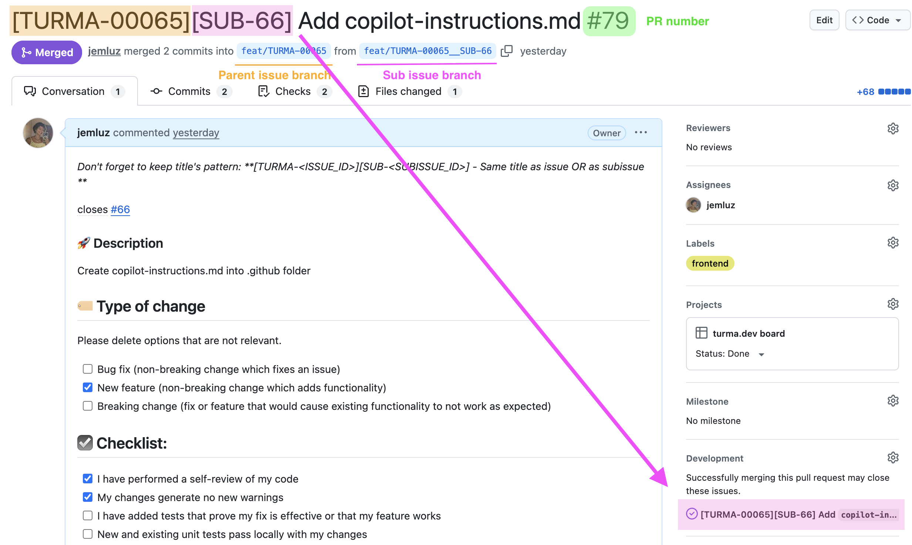

# Dev Workflow (Optimized)

Clear, small, traceable delivery flow for this repository.

## 🎯 Goal

Keep changes small and continuous, with explicit links across:

`release -> milestone -> issue -> sub-issue -> branch -> commit -> PR`

Use sub-issues whenever scope grows.

## 🧩 Templates

- Pull Request template: [../../pull_request_template.md](../../pull_request_template.md)
- Issue templates: [../](../)

## 🥸 Core Rules

1. Create issue before coding (to get issue number).
2. Use naming patterns exactly.
3. Use Semantic Commit Messages with issue/sub-issue identifiers.
4. PR target depends on branch type (parent or sub).
5. Only squash merge allowed.
6. Keep Milestone only on parent issues and parent PRs.

### 🚀 Release

Functional version grouping one or more milestones.

### 🪨 Milestone

Package of related parent issues.

Milestone field policy:

- MUST set Milestone on parent issues.
- MUST set Milestone on PRs from parent issue branches to `dev`.
- DON'T set Milestone on sub-issues or sub-issue PRs.

This approach will make easy to understand the main features/updates which was delivered into each a new version/release.

## 📌 (Parent) Issue Flow

A parent issue is a key point to be done within a milestone.

Every issue _starts_ by creating a new branch from the `dev` branch, and when done, _ends_ with a _Pull Request_ from that issue branch pointing back to `dev` branch.

### 1) Parent issue title

Pattern:

`[REPO-XXXXX] Title`

Examples:

- Issue `#86` -> `[REPO-00086] Timeline improvements`
- Issue `#3` -> `[REPO-00003] Setup CI`

`REPO` MUST be a short repository acronym (examples: `EVAST`, `TURMA`, `PORT`).

### 2) Parent branch name

Pattern:

`feat/REPO-XXXXX`

Examples:

- `feat/REPO-00086`
- `feat/REPO-00003`

### 3) Parent branch commits

MUST follow [Semantic Commit Messages](https://gist.github.com/joshbuchea/6f47e86d2510bce28f8e7f42ae84c716)

Pattern:

`type(IXX): message`

Examples:

- `feat(I65): add timeline keyboard navigation`
- `fix(I65): adjust content scroll synchronization`

## 📍 Sub-issue Flow

Create sub-issues when parent issue becomes too large.

### 1) Sub-issue title

Pattern:

`[REPO-XXXXX][SUB-YY] Title`

Examples:

- Parent `#86`, Sub `#89` -> `[REPO-00086][SUB-89] Docs and icons`
- Parent `#3`, Sub `#4` -> `[REPO-00003][SUB-4] Initial scripts`

### 2) Sub-issue branch name

Pattern:

`feat/REPO-XXXXX__SUB-YY`

Rules:

- Source branch MUST be the related parent branch (`feat/REPO-XXXXX`).

Examples:

- `feat/REPO-00086__SUB-89` (from `feat/REPO-00086`)
- `feat/REPO-00003__SUB-4` (from `feat/REPO-00003`)

### 3) Sub-issue commits

MUST follow [Semantic Commit Messages](https://gist.github.com/joshbuchea/6f47e86d2510bce28f8e7f42ae84c716)

Pattern:

`type(IXX_SYY): message`

Example:

- `feat(I65_S71): add icons to documentation headings`

## Pull Requests

Every PR closes an issue or sub-issue step and must reference that issue.

### PR target branch

- Parent branch PR: `feat/REPO-XXXXX` -> `dev`
- Sub-issue branch PR: `feat/REPO-XXXXX__SUB-YY` -> `feat/REPO-XXXXX`

### Merge strategy

- Allowed: squash merge only
- Not allowed: merge commit, rebase merge (to prevent contaminate main/dev bacnhes history with a buch of feature's commit fragments)

### Squash title and description

Parent PR (`issue branch -> dev`):

- Title: `[REPO-XXXXX] title (PR #ZZ)`
- Description start: `more details at #XX`

Sub-issue PR (`sub-issue branch -> parent branch`):

- Title: `[REPO-XXXXX][SUB-YY] title (PR #ZZ)`
- Description start: `more details at #YY`

`#XX` and `#YY` MUST reference corresponding issue/sub-issue.

## Canonical Patterns (Quick Reference)

| Type         | Title Pattern                | Branch Pattern            | Commit Pattern           | PR Title Pattern                      | PR Base           |
| ------------ | ---------------------------- | ------------------------- | ------------------------ | ------------------------------------- | ----------------- |
| Parent issue | `[REPO-XXXXX] Title`         | `feat/REPO-XXXXX`         | `type(IXX): message`     | `[REPO-XXXXX] Title (PR #ZZ)`         | `dev`             |
| Sub-issue    | `[REPO-XXXXX][SUB-YY] Title` | `feat/REPO-XXXXX__SUB-YY` | `type(IXX_SYY): message` | `[REPO-XXXXX][SUB-YY] Title (PR #ZZ)` | `feat/REPO-XXXXX` |

## Validation Checklist

- [ ] Branch name matches expected pattern.
- [ ] PR base branch is correct (`dev` or parent issue branch).
- [ ] Commit messages follow semantic + issue identifier format.
- [ ] PR title follows required pattern.
- [ ] PR references related issue/sub-issue.
- [ ] PR description starts referencing related issue/sub-issue with `more details at #__`.
- [ ] Merge strategy is squash.

## 🤖 AI Skill Execution Flow

Run skills in this exact order:

`current-opened-check -> issue-create -> branch-commit-pattern -> pr-create -> workflow-validate`

Deterministic rules:

1. `current-opened-check` is mandatory and must run first.
2. `current-opened-check` must search open parent issues and sub-issues using default semantic matching over title + body.
3. If related issue/sub-issue is found, classify confidence (`high`, `medium`, `low`) and ask user to reuse existing or create new.
4. If user reuses existing issue/sub-issue, skip `issue-create` and carry selected context to remaining skills.
5. `issue-create` applies only when creating a new issue/sub-issue and must enforce title and milestone policies from this workflow.

### Small Examples

1. Related issue found path
   - Input: "Improve timeline keyboard navigation"
   - `current-opened-check` finds open `#86 [REPO-00086] Timeline improvements` with `high` confidence.
   - User chooses reuse -> skip `issue-create` -> continue with `branch-commit-pattern`.

2. No related issue path
   - `current-opened-check` returns `no-related-found`.
   - Continue to `issue-create` and create parent issue `[REPO-00120] Timeline keyboard navigation`.

3. Parent issue flow
   - Branch: `feat/REPO-00120`
   - Commit: `feat(I120): add keyboard arrow support`
   - PR: `[REPO-00120] Timeline keyboard navigation (PR #45)` -> base `dev`
   - PR body first line: `more details at #120`
   - Milestone: allowed.

4. Sub-issue flow
   - Parent issue `#120`, sub-issue `#121`.
   - Branch: `feat/REPO-00120__SUB-121`
   - Commit: `feat(I120_S121): add docs for keyboard shortcuts`
   - PR: `[REPO-00120][SUB-121] Keyboard shortcut docs (PR #46)` -> base `feat/REPO-00120`
   - PR body first line: `more details at #121`
   - Milestone: forbidden.
